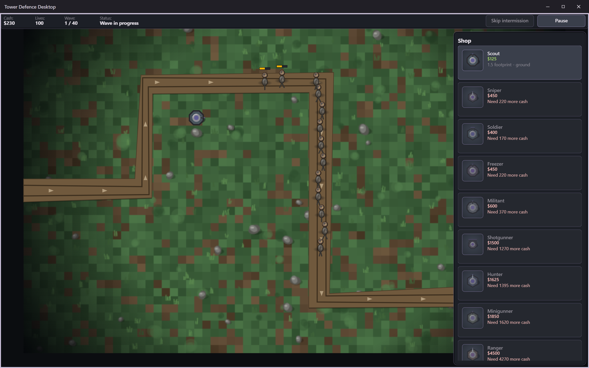

# Tower Defence Desktop

A deterministic tower defense game for Windows.

The simulation reproduces the mechanics and published statistics of Roblox Tower
Defense Simulator: the same targeting modes, status effects, income model, wave
structure and difficulty behaviour, with every sourced number carrying the wiki URL
and the date it was read, inside the data file itself.



<details>
<summary><b>Contents</b></summary>

- [What works today](#what-works-today)
- [Running it](#running-it)
- [How it is built](#how-it-is-built)
- [Where the numbers come from](#where-the-numbers-come-from)
- [Checks](#checks)
- [Known gaps](#known-gaps)
- [Licence and attribution](#licence-and-attribution)

</details>

## What works today

A match plays end to end. You place towers, upgrade them, sell them, change their
targeting, watch waves arrive, and win or lose.

| | |
| --- | --- |
| Towers | 12, every upgrade level, real costs and statistics |
| Enemies | 10, including 3 bosses |
| Maps | 2 |
| Difficulties | 6 |
| Wave schedules | 12 |
| Checks | 159 |

<details>
<summary><b>Every mechanic the engine carries</b></summary>

Lane pathing with per-enemy speed and a deterministic spread so a pack does not render
as one line. Status effects with three distinct stacking rules, real immunities, and
damage that bypasses flat mitigation. Auras that recompute a tower's effective stats
every tick rather than mutating its base stats. Five targeting modes with deterministic
tie-breaking. Hidden enemies versus detection, and flying versus anti-air, including a
reveal effect that makes a hidden enemy targetable by anything. Firing with rate,
cooldown, spin-up, burst and reload, hitscan and travelling projectiles, area damage,
pierce and chain. Damage ordered shield, then flat reduction, then health. Tag-based
synergy bonuses, so a future tower pairing is two data rows rather than a new branch.
Tower abilities on cooldown, and enemy abilities including a one-shot health-threshold
trigger. An economy paid on the wave boundary. A data-driven wave director. Placement
by terrain polygon, footprint collision and shared caps. Win and loss conditions.

</details>

## Running it

From a fresh checkout on a Windows machine with nothing installed:

```
.\build.bat --run
```

That fetches its own dependencies, builds, verifies what it built, and only then
launches. `build.bat /s` runs silently and exits non-zero on the first failure.

To produce the installer the release workflow publishes:

```
.\build-installer.bat
```

> [!WARNING]
> **The installer is unsigned, and always will be.** Windows shows an
> unknown-publisher warning. That is expected, is not being worked around, and is not
> a claim that the file is safe.

## How it is built

**Deterministic core.** A fixed 30 Hz tick, one seeded random stream whose position is
part of the state hash, fixed-point integer positions, and a command queue applied at
tick boundaries in a strict order. A match replays exactly from its seed and command
log, proven by running the same inputs twice and comparing a hash taken every second.
That is what would make co-operative play addable later without a rewrite.

**No bundler.** Plain ES modules with JSDoc types, checked by TypeScript with no
transpile step, so one copy of the code runs in Node checks, a browser and the desktop
shell. The simulation imports nothing from the interface or the shell, which is what
lets every determinism proof run headlessly.

**A new tower is a data row.** If adding one needs a change under `src/sim`, the data
shape was wrong and the shape is what changes.

## Where the numbers come from

Every row says where it came from and is not allowed to pretend. It either carries a
wiki URL and a retrieval date, or it declares itself an engine default and says why in
a sentence. There is deliberately no third option, and both the validator and an
independent check enforce it.

The full picture, including the six statistics that are still unresolved and the
things that are engine defaults rather than sourced, is in
[docs/data-sources.md](docs/data-sources.md).

## Checks

```
npm run check
```

Type check, determinism check, data validation, site contract, documentation bundle,
and 159 tests.

> [!NOTE]
> **Continuous integration runs no tests and no lint**, by standing decision. It
> builds, packages, publishes and attaches evidence. Checking happens locally, before
> a push, and the [release checklist](docs/build-and-release/release-checklist.md)
> says so. The honest cost: a release can ship from a commit whose checks would have
> failed.

## Known gaps

Recorded rather than hidden. `src/render` and `src/ui` sit outside the TypeScript
check and do not currently pass it; they are covered by 51 behaviour checks, which is
not the same thing. Roughly thirty further towers and a great many more enemies exist
in the source game and are absent here rather than approximated. The full list is in
[ROADMAP.md](ROADMAP.md).

## Licence and attribution

MIT.

Tower Defense Simulator is the work of its own authors. This project reimplements game
mechanics and reproduces published statistics. It ships no assets, no code and no
written text from that project; the maps, wave schedules and all descriptive prose
here are original.
